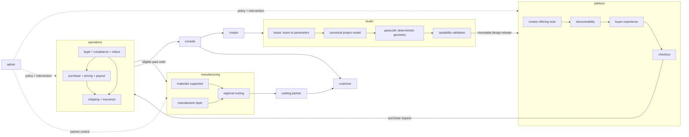

# sculptura

> a path from a jewelry idea to a manufacturable, sellable, made-to-order piece, without requiring a workshop, inventory, or years of cad training.

## the problem

many people already have strong creative instincts. they save references, build pinterest boards, notice forms and details, and can describe the piece they wish existed. what often never occurs to them is that they could become the creator.

traditional jewelry design makes that leap feel out of scope. the person is expected to learn difficult and expensive cad software, understand manufacturing constraints, source metal and specialist suppliers, fund prototypes, hold inventory, arrange photography and sales, and solve fulfillment before the first piece has even found a buyer.

that filters out people with taste and ideas long before their work can become real. sculptura exists to patch that gap.

## what sculptura changes

sculptura connects four stages that are normally fragmented:

1. shape an idea into precise, editable jewelry parameters
2. turn those parameters into deterministic geometry and validate whether it can be made
3. publish the approved design as an offer without requiring inventory
4. route each paid order to an eligible manufacturing partner for casting, finishing, and delivery

the creator remains the author. sculptura removes technical and operational barriers around that authorship.

## how creative assistance works

creators can work directly with the studio controls, but they do not have to master conventional cad software first.

**tessa** is the studio's vision-model assistant. tessa looks at references, listens to the creator's description, and helps identify the dimensions, profiles, repetitions, relationships, and other parameters that express the creator's intent.

tessa does not generate geometry, meshes, or production files. her output is a constrained handoff to **paracraft**, the deterministic geometry engine. in practical terms, tessa understands the vision and tunes approved knobs; paracraft constructs the result. the production path therefore contains no model-invented geometry. every accepted change is inspectable, bounded, reproducible, and subject to manufacturing validation.

## the shape of the system

sculptura has four product surfaces and two execution domains.

### product surfaces

- **studio** is where creators shape intent, operate paracraft, validate geometry, and issue design releases
- **platform** is where released designs become listings, storefront products, commissions, and purchases
- **console** is where creators and buyers see orders, money, delivery, support, and account state
- **admin** is the control tower for review, policy, routing, partner control, and intervention

### execution domains

- **manufacturing** knows what can be made, by whom, from which materials, under which constraints
- **operations** owns purchase, payout, pricing, settlement, refunds, insurance, shipping, legal, compliance, and market availability

console is not the financial engine. it is a product surface over operations. admin does not contain manufacturing. it configures and supervises it.



## creator-to-customer flow

```text
idea and references
  ↓
studio project with explicit parameters
  ↓
paracraft geometry and manufacturing validation
  ↓
versioned design release
  ↓
platform listing
  ↓
route eligibility and trusted price
  ↓
purchase and settlement record
  ↓
regional manufacturing route
  ↓
cast, finish, insure, and ship
```

buyers do not operate tessa or paracraft. creators do. ordinary listings support guest checkout. commissioners require accounts because a commission involves a creator relationship, conversation history, revisions, approval, payment protection, cancellation, and disputes.

## repository map

```text
studio/
  creators/
  design-agent/
  project-model/
  geometry/
  validation/
  releases/
  virtual-studio/

platform/
  creators/
  buyers/
  discoverability/
  storefronts/
  commissions/
  checkout/

console/
  creators/
  buyers/
  support/
  reporting/

admin/
  review/
  manufacturer-control/
  routing-control/
  platform-policy/
  audit/

manufacturing/
  materials-supported/
  routing/
  manufacturer-layer/
  quotes/
  quality/
  reference/
  research/
  schemas/
  tasks/

operations/
  financial/
    purchase/
    payout/
    pricing/
    settlement/
    refunds/
  insurance/
  shipping/
  legal/
  compliance/
  country-rollout/

contracts/
  design-release.md
  design-release.schema.json
```

## boundaries that do not bend

- only studio generates and validates geometry
- tessa may interpret intent and propose constrained parameters, but never generates production geometry
- only paracraft turns approved parameters into geometry
- only platform manages listings, discovery, storefronts, carts, and buyer-facing checkout
- only operations computes trusted prices, moves money, manages delivery protection, and decides whether a route is available
- only manufacturing owns material capability truth, manufacturer adapters, quotes, and route eligibility
- console presents operational state but does not become its source of truth
- admin changes policy and handles exceptions but does not duplicate domain logic
- studio and platform communicate through immutable, versioned design releases rather than shared mutable project state

## rollout detail

market availability, creator onboarding, shipping clusters, hallmarking, customs, and route activation are operational concerns. they live under [`operations/country-rollout`](operations/country-rollout/README.md) and [`operations/shipping`](operations/shipping/README.md), not in this introduction.

## current line in the sand

- metal-only jewelry at launch, with no supplied stones
- immutable design releases between studio and platform
- two-way pricing: fix creator earnings or fix retail price
- manufacturer evidence remains drafted until checked and accepted
- commissions remain muted until authentication, conversation, escrow, approval, cancellation, and disputes work together
- no unsupported route silently reaches checkout
- no client-provided price, manufacturing cost, earnings value, or validation claim is trusted

## implementation audit

[`docs/current-state-audit.md`](docs/current-state-audit.md) maps both existing source repositories to this target architecture and distinguishes what already exists from what must move, be rewritten, or be built.
