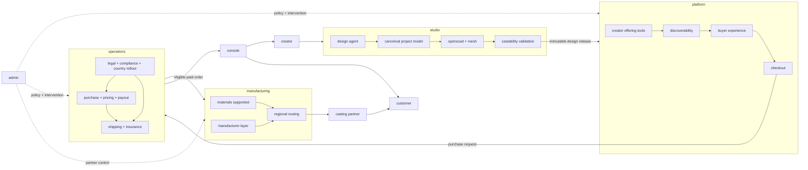

# sculptura

> ai-assisted jewelry cadding, offering, production, and delivery without making creators become cad operators, manufacturers, or logistics teams.

## the shape of the system

sculptura has four product surfaces and two execution domains.

### product surfaces

- **studio** is where creators turn intent into validated geometry
- **platform** is where designs become discoverable and buyable
- **console** is where creators and buyers see money, orders, delivery, and support
- **admin** is the control tower for review, policy, routing, and intervention

### execution domains

- **manufacturing** knows what can be made, by whom, from which materials, under which constraints
- **operations** owns purchase, payout, pricing, settlement, refunds, insurance, shipping, legal, compliance, and country availability

console is not the financial engine. it is a product surface over operations. admin does not contain manufacturing. it configures and supervises it.



## creator-to-customer flow

```text
idea
  ↓
studio project
  ↓
validated design release
  ↓
platform listing
  ↓
country eligibility + trusted price
  ↓
purchase and settlement record
  ↓
regional manufacturing route
  ↓
cast, finish, insure, and ship
```

buyers do not operate the design agent. creators do. ordinary listings support guest checkout. commissions later require buyer authentication, a creator conversation, escrow, acceptance rules, and dispute handling before they can become real.

## repository map

```text
studio/
  creators/
  design-agent/
  project-model/
  geometry/
  validation/
  releases/
  virtual-studio/

platform/
  creators/
  buyers/
  discoverability/
  storefronts/
  commissions/
  checkout/

console/
  creators/
  buyers/
  support/
  reporting/

admin/
  review/
  manufacturer-control/
  routing-control/
  platform-policy/
  audit/

manufacturing/
  materials-supported/
  routing/
  manufacturer-layer/
  quotes/
  quality/
  reference/
  research/
  schemas/
  tasks/

operations/
  financial/
    purchase/
    payout/
    pricing/
    settlement/
    refunds/
  insurance/
  shipping/
  legal/
  compliance/
  country-rollout/

contracts/
  design-release.md
  design-release.schema.json
```

## boundaries that do not bend

- only studio generates and validates geometry
- only platform manages listings, discovery, storefronts, carts, and buyer-facing checkout
- only operations computes prices, moves money, manages delivery protection, and decides whether a destination is currently supported
- only manufacturing owns material capability truth, manufacturer adapters, quotes, and route eligibility
- console presents operational state but does not become the source of truth for it
- admin changes policy and handles exceptions but does not duplicate domain logic
- platform and manufacturing communicate through versioned contracts, never shared mutable studio state

## country rollout

creator signup and shipping have separate geography.

creator signup is intended wherever the connected-payout provider supports the required account type, subject to provider and legal restrictions. full kyc is deferred by product intent until payout eligibility at $20 or €20, but provider requirements may trigger it earlier.

first shipping cohort: united states, canada, united kingdom, australia, germany, france, italy, netherlands, spain, belgium, austria, switzerland, sweden, denmark, ireland, and new zealand. canada, australia, switzerland, sweden, and denmark carry a product-planning high-ppp priority flag. ireland and new zealand carry an internal freebie-candidate tag, not a customer-facing promise. japan, south korea, singapore, the united arab emirates, and non-eu norway remain on research hold until suitable regional distributed casting zones and operating routes are established; norway is also high-ppp priority.

shipping stays deny-by-default until each country's manufacturing route, hallmarking, customs, tax, carrier, insurance, returns, and consumer requirements are approved. see [`operations/country-rollout`](operations/country-rollout/README.md).

## current line in the sand

- metal-only jewelry at launch, with no supplied stones
- immutable design releases between studio and platform
- two-way pricing: fix creator earnings or fix retail price
- manufacturer research stays `drafted` until checked and accepted
- commissions remain muted until the whole escrow lifecycle exists
- no unsupported country silently reaches checkout
