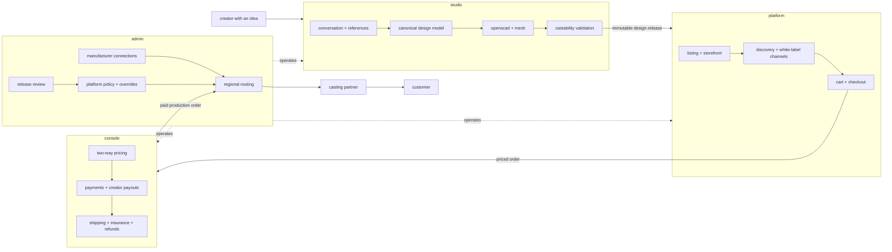

# sculptura

> a way to turn the piece of jewelry someone can already see in their head into something manufacturable, sellable, and real.

## what is this

sculptura is ai-assisted cadding for people who already have the taste and the idea. the creator talks through what they mean, the studio turns that into deterministic parametric geometry, and the rest of the system gets it validated, listed, sold, routed, cast, and shipped.

buyers do not use the design agent. creators do. a buyer can purchase a finished listing without an account; the later commission flow lets a logged-in buyer bring references and a messy brief to a creator, who uses the studio to do the actual design work.

metal only. no supplied stones. an empty bezel for a buyer's own stone may happen later, but it is not part of the launch surface.

---

## why four sides

because geometry, storefronts, money, and operations are different jobs, and putting them in one cheerful folder is how everything eventually learns too much about everything else.



### studio

the creative side. it owns the agent conversation, project model, geometry generation, openscad source, mesh compilation, mass estimation, and manufacturing validation. its output is a versioned **design release**. it knows nothing about carts, payouts, coupons, or orders.

### platform

the offering side. it owns listings, shops, discovery, white-label storefronts, connected sales channels, carts, checkout, buyer accounts, and the future commission intake. it can only list a design release that passed studio validation. it never generates or validates geometry.

### console

the practical money-and-delivery side creators need after they publish. it owns manufacturing cost snapshots, the two-way pricing model, platform fees, creator earnings, payouts, coupons, shipping, insurance, refunds, and settlement records. the platform displays its numbers; it does not recalculate them.

### admin

the control tower. it owns review queues, manufacturer adapters, regional routing rules, platform settings, operational overrides, and audit trails. manufacturers plug into sculptura through adapters and apis. they do not need their own sculptura-facing portal.

---

## the seam that keeps this sane

studio and platform communicate through one object: the [design release](contracts/design-release.md).

it is versioned and immutable. changing a design creates a new release instead of mutating the geometry behind an order that already exists. the platform stores a release id, not a live pointer into a creator's current studio session.

```text
idea
  ↓
studio project
  ↓
validated design release
  ↓
listing
  ↓
priced order
  ↓
regional manufacturing route
  ↓
cast + finish + ship
```

---

## repository map

```text
systems/
  studio/       geometry, validation, design-release production
  platform/     listings, storefronts, discovery, checkout
  console/      pricing, payouts, shipping, insurance, settlement
  admin/        review, manufacturer connections, routing, policy

contracts/
  design-release.md
  design-release.schema.json

docs/
  architecture/
  behind-the-scenes/
    manufacturing/
      tasks/        research briefs and open checks
      schemas/      cited manufacturer capability contract
      adapters/     adapter prototypes, not production credentials
      reference/    structured, source-bound findings
      research/     one evidence note per candidate
    payments/

security/       concrete security findings and their fixes
migrations/     reviewed database changes, never auto-applied
```

## current line in the sand

we are consolidating the foundation, not pretending the engine or escrow already exists.

- the studio shell is being separated from commerce before deeper engine work
- commissions stay visible but muted until login, conversation state, payment hold, acceptance, disputes, and release rules exist together
- manufacturer candidates stay `drafted` until a human checks the cited evidence; only `accepted` records may enter automatic routing
- live payouts come after incorporation and use stripe connect unless later evidence changes the decision
- placeholder manufacturing prices and tolerances never become production facts just because they already exist in code
