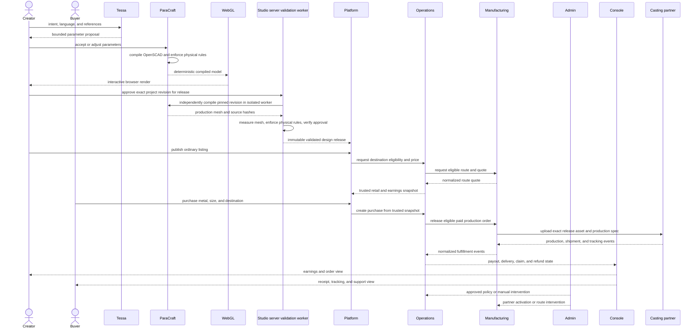

# end-to-end flow

## optional commission progression

commissioning is not the entry point and is never enabled by creator signup.

1. a person becomes a creator
2. the creator develops private studio projects
3. passing work becomes design releases
4. the creator publishes ordinary made-to-order listings
5. the creator may later toggle commissions on
6. authenticated commissioners submit briefs to that creator
7. the creator remains the only person operating tessa and paracraft
8. the commission uses the same release, pricing, payment-protection, manufacturing, and fulfillment boundaries
9. the creator may pause new commissions without removing ordinary listings

platform owns the authenticated conversation surface. operations owns payment or milestone protection (not automatically legal escrow), acceptance, cancellation, and dispute state. studio still emits the exact release.
