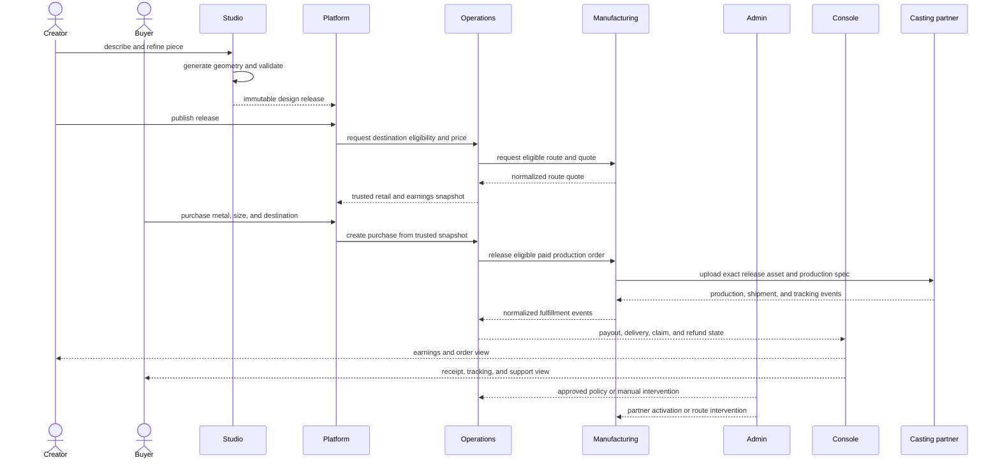

# end-to-end flow

## commissions later

commissioning adds an authenticated brief and an escrow lifecycle before release, but keeps the same ownership. the commissioner gives requirements to a creator. the creator uses studio. studio emits the release. platform owns the conversation surface; operations owns escrow, acceptance, cancellation, and dispute state.
