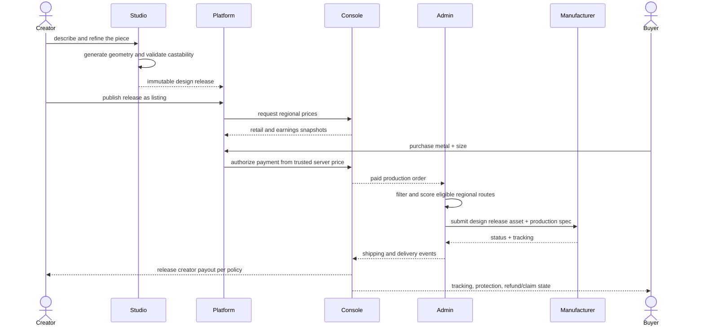

# end-to-end flow

## commissions later

commissioning adds a second pre-release conversation, but it does not change the core boundary. the commissioner gives references and requirements to a creator. the creator uses studio. studio still emits the release. escrow and acceptance belong to console/platform, not studio.
