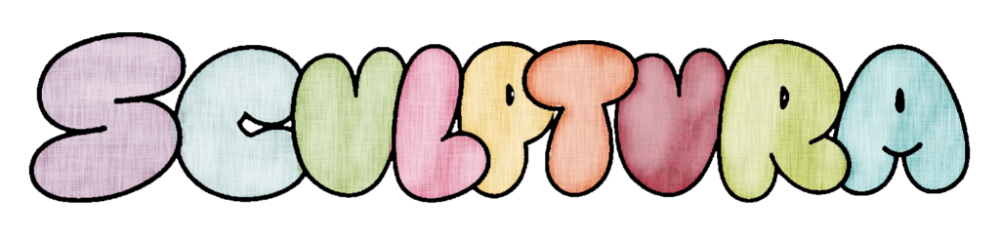

# brand

visual identity assets: wordmark, marks, and usage notes.

## wordmark

hand-lettered, lowercase, bubble-letter wordmark in a soft pastel palette (lilac, seafoam, sage, butter, peach, rose, olive, sky). matches the product's lowercase-everywhere voice: the wordmark itself is lowercase, no capitalization, no emojis, no em dashes anywhere around it.

`wordmark.png` is the source file. use it as-is; do not recolor, add a tagline into the mark, or set it in a different case.

## status

first asset checked in. palette extraction, a monochrome variant, and favicon-sized marks are not made yet.
