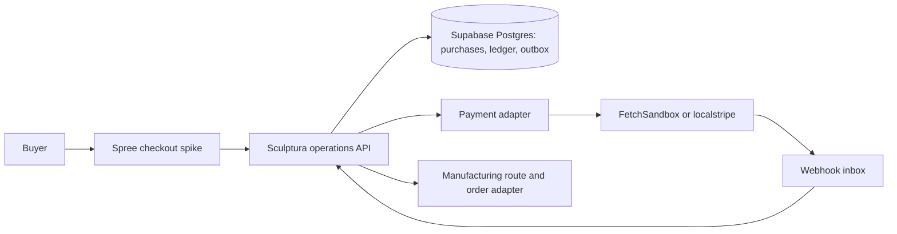

# mock finance flow: draft before integration

**status:** architecture and test plan, not an installed stack or live payment capability. documented 2026-09-23.

## decision and caveat

pair spree commerce with localstripe and/or fetchsandbox for checkout experiments **before connecting to stripe**, while retaining Supabase/Postgres as sculptura's operational source of truth. represent buyer, platform, creator, manufacturer, tax, shipping, reserves, and payment-processor positions as **logical accounts in an internal balanced ledger**. a mock payment api object is not a regulated bank balance or a provider-backed connected account. stripe is the intended **later production** payments/Connect rail, not a prerequisite for this prototype.

- **spree:** trial commerce façade for cart, checkout, order and seller features. adapt its product/order model to reference immutable design release ids, selected alloy/size, and trusted route/price snapshots. do not assume installing spree replaces the existing platform or supabase; run a narrow spike first. spree 6 documentation describes open-source seller order splits, a payout ledger, and stripe connect transfers, but those stripe-connected payout features are **not part of this pre-stripe spike**. validate the exact version, packaging, interfaces, and licensing before adopting those features.
- **fetchsandbox:** first candidate for stateful stripe-like http responses and failure scenarios. it advertises accounts, transfers, paymentintents, refunds, disputes, and webhooks, but the public feature listing does **not** prove end-to-end connect semantics, payout accounting, stripe elements compatibility, or parity with the exact spree integration. test the required endpoints and payloads rather than inferring them from the resource list.
- **localstripe:** useful for standalone local payments and some webhook tests, but its readme explicitly says **no stripe connect support**. it cannot by itself model the requested artist and manufacturer transfer buckets.
- **Adapter/fake ledger:** a small server-side payment port calls the selected mock. the authoritative logical buckets and their transitions live in supabase, not in either mock provider. no real keys or cards are used. if the spree gateway hardcodes stripe urls, use a configurable SDK/API base url or a narrow gateway adapter; avoid a global network reroute. browser-side Elements/Checkout calls need separate testing, since rerouting server requests alone will not intercept browser traffic.

## ownership and event boundaries

spree owns the prototype cart and checkout surface. the sculptura operations api validates the exact design release, eligible material/size, destination, route, quote expiry, pricing mode, tax and fee policy, and creator before creating the canonical purchase. spree order id is an external commerce reference, not a second authoritative settlement record. no platform-controlled browser field can assert payment success or change the net earnings.

## mock state machine

1. **quote:** route-aware, expiry-bound snapshot computes one of two modes: fixed creator net implies calculated retail, or fixed retail implies calculated creator net. snapshot includes exact release hash, currency, tax presentation, manufacturer quote, shipping, processor assumptions, policy versions, and allocation amounts.
2. **order intent:** spree sends a checkout request with a stable idempotency key; operations creates pending purchase and ledger correlation ids in supabase. a retry returns the same purchase.
3. **authorization:** payment adapter asks the mock to authorize the buyer charge. record provider intent id. **authorization is not captured money and does not credit a payable bucket.** test declines, 3ds, timeouts, duplicate replies, and expiry.
4. **capture:** only after server-side quote and availability recheck, capture via the adapter; settle purchase state from authenticated, deduplicated provider webhook or verified provider read, never browser redirect alone. post balanced ledger entries transactionally with an outbox record. this is the moment simulated funds enter the platform clearing position.
5. **allocate:** assign the captured amount to creator payable pending, manufacturer payable, taxes payable, delivery/insurance payable, platform contribution, and explicit reserves/processing expenses according to the immutable snapshot. these are **bookkeeping allocations**, not automatic stripe connect transfers.
6. **manufacture:** create one idempotent production order for the exact release and accepted route. approve any mock manufacturer disbursement only against a real order/quote reference and a configured milestone; do not send actual virtual cards in this prototype.
7. **fulfill and release:** ingest production and shipment events; after the configured delivery, acceptance, and claim policy, move creator payable from pending to eligible, then record provider transfer/payout results if that adapter can model them. use a separate test of actual connect semantics later.
8. **exceptions:** authorization failure returns to payment pending; capture failure never dispatches production. handle quote expiry, partner rejection, refunds before/after manufacturing, partial refunds, disputes, payout failure, duplicate/out-of-order webhooks, reversals, and reconciliation mismatches with compensating entries, not ledger edits.
9. **reconcile:** compare spree order reference, provider intent/charge/refund ids, canonical purchase, ledger sums, partner charge, creator liability and outbox status. alert on unmapped or duplicated events.

### illustrative balanced capture (not pricing policy)

for a hypothetical **120 unit** buyer charge, a debit of 120 to mock processor clearing is balanced by credits of 50 to creator payable pending, 40 to manufacturer payable, 10 to tax payable, 10 to delivery payable, and 10 to platform gross contribution. each side totals 120. in reality, processor fees, insurance, reserves, refunds, tax treatment, seller-of-record duties, and timing change these entries. the buyer is an external counterparty, not an internal wallet with spendable fake funds.

## deliberate phases

1. **pre-stripe prototype:** spree + localstripe for basic payment behaviors and/or fetchsandbox for endpoints it actually implements; simulate role allocations in the internal ledger. no real stripe account, test key, or production provider traffic.
2. **production integration, later:** after the commercial and financial state machine is validated, integrate stripe and stripe connect with actual provider behavior, identity/KYC requirements, transfers, payouts, refunds, and reconciliation. re-verify all mock assumptions against stripe test mode before live funds move.

## first spike and exit criteria

- pin versions and licenses of spree, its stripe extension, and the chosen mock.
- trace the exact http calls made by the spree payment integration, including browser-side flows, webhook signature handling, and any connect account/transfer calls spree tries to make. exercise the relevant calls against fetchsandbox; do not make connect a blocker for modeling logical creator/manufacturer allocations; use localstripe only for payments cases it demonstrably supports.
- implement one narrow order: listed metal-only release, eligible route, server-computed two-way price snapshot, mock authorization/capture, webhook, balanced allocation, fake manufacturer milestone, and creator payout eligibility.
- assert invariants: all entries balance per currency, one capture creates at most one settled purchase, no production before verified capture, no paid payout from an authorization, no negative creator earnings, release ID/hash never change, refund/reversal entries reconcile.
- exercise declined, expired, duplicated, out-of-order, refunded, disputed, and partner-failure cases. if the mock does not support the required semantics, substitute a purpose-built test adapter rather than distorting the production payment design to fit it.

**not escrow:** internally holding or delaying a creator payable is not legal escrow. money movement, merchant of record, connect charge type, reserves, payouts, consumer rights, and any actual escrow arrangement require separate provider and legal review before live transactions.

## source checks

- spree marketplace guide: https://spreecommerce.org/docs/use-case/marketplace/capabilities
- spree stripe integration: https://github.com/spree/spree_stripe
- fetchsandbox stripe feature listing: https://fetchsandbox.com/stripe
- localstripe limitation: https://github.com/adrienverge/localstripe
