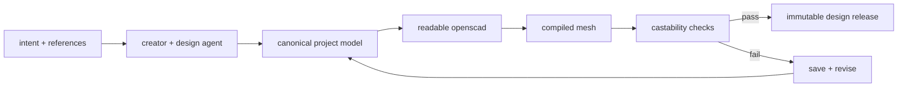

# studio

studio is for creators. it turns intent into deterministic, manufacturable metal geometry.

## owns

- creator-to-agent design conversation
- references, parameters, presets, and project state
- canonical openscad source
- deterministic mesh compilation
- castability validation and mass estimates
- versioned design-release creation

## does not own

- listings or storefronts
- retail pricing, platform fees, or payouts
- orders, shipping, insurance, or refunds
- manufacturer selection

## flow

same parameters in must produce byte-identical geometry out. inference may suggest a candidate parameter set, but inference never generates geometry and never decides whether something is castable.

## current implementation

see the [complete source audit](../docs/current-state-audit.md) and the audited implementation reference in each subfolder.
