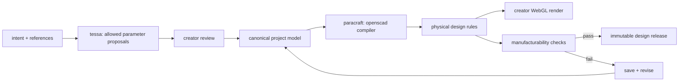

# studio

studio is for creators. it turns intent into deterministic, manufacturable metal geometry.

## owns

- creator projects, references, parameters, presets, and revisions
- Tessa's constrained intent-to-parameter relay
- ParaCraft, the deterministic compiler framework built on OpenSCAD
- creator-facing in-browser WebGL rendering of the compiled model
- physical design rules such as wall thickness, shrinkage, clearances, minimum features, and process limits
- deterministic mesh and production-file compilation
- castability validation and mass estimates
- versioned design-release creation

## does not own

- listings or storefronts
- retail pricing, platform fees, or payouts
- orders, shipping, insurance, or refunds
- manufacturer selection
- stones, gemstone inventory, grading, sourcing, or setting fulfillment

## flow

Tessa runs the middle leg of the relay. she translates human intent into constrained parameter proposals. ParaCraft takes the accepted parameters, compiles the OpenSCAD model, and enforces the physical boundaries. the WebGL layer renders that deterministic result in the browser.

same parameters, compiler version, and rule-set version in must produce the same geometry out. inference never generates geometry and never decides whether something is castable.

## current implementation

see the [complete source audit](../docs/current-state-audit.md) and the audited implementation reference in each subfolder.
